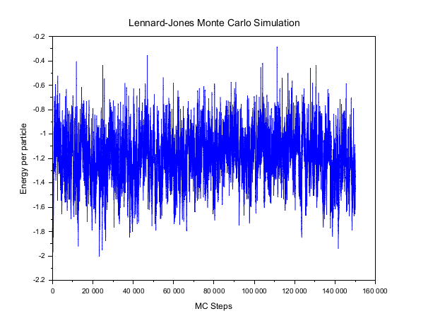
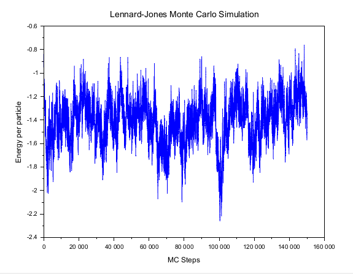
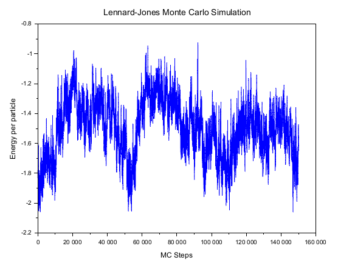
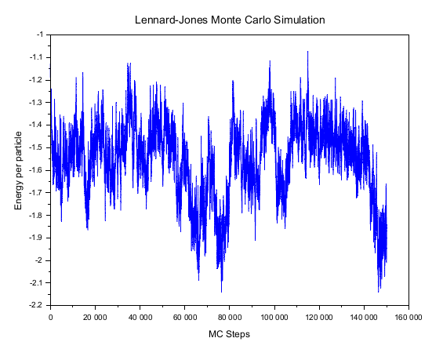
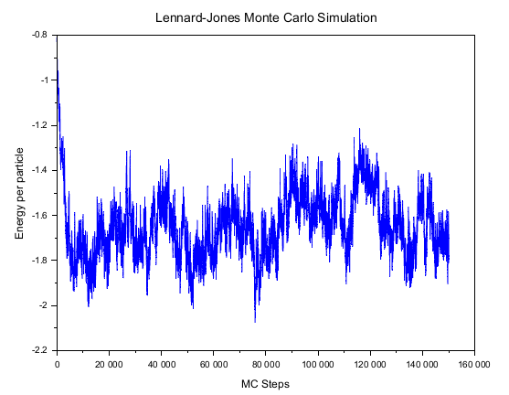
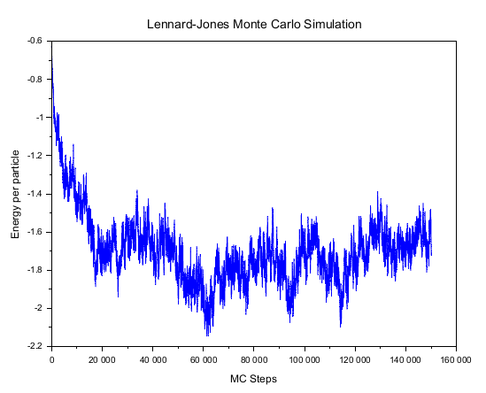
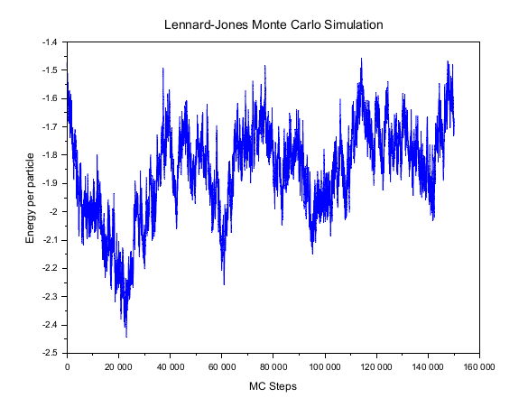
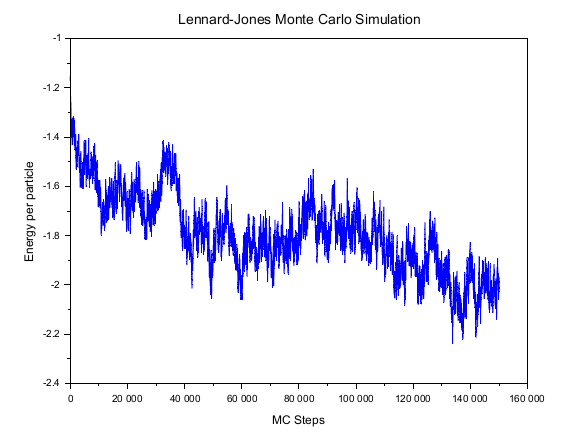

# Monte Carlo Simulations in Statistical Physics

**Author:** Puspa Kamal Rai  
**Affiliation:** Department of Physics, Sri Sathya Sai Institute of Higher Education  
**Program:** M.Sc. Physics  

🔗 Portfolio: https://puspa-opal.vercel.app/  
🔗 Code Repository: https://github.com/puspkml/MonteCarlo  

---

## Overview

This repository contains two Monte Carlo simulation studies:

1. **Lennard–Jones Simulation of Argon Gas (Canonical Ensemble)**
2. **Estimation of π using Random Sampling**

Both projects demonstrate the power of stochastic methods in physics—from many-body systems to numerical estimation.

---

# 1. Monte Carlo Simulation of Argon Gas

## Abstract

A Monte Carlo simulation of a Lennard–Jones fluid representing argon gas is performed in the canonical ensemble. The Metropolis algorithm is used to sample equilibrium configurations. Systems from 10 to 80 particles are analyzed to study acceptance rates and energy per particle, highlighting finite-size effects.

---

## Theory

### Canonical Ensemble Probability

\[
P(\mathbf{r}^N) = \frac{e^{-\beta U(\mathbf{r}^N)}}{Z}, \quad \beta = \frac{1}{k_B T}
\]

\[
Z = \int d\mathbf{r}^N \, e^{-\beta U(\mathbf{r}^N)}
\]

---

## Lennard–Jones Potential

\[
U(r) = 4 \left[ \left(\frac{1}{r}\right)^{12} - \left(\frac{1}{r}\right)^6 \right]
\]

- Repulsive term: \( r^{-12} \)
- Attractive term: \( r^{-6} \)
- Cutoff radius: \( r_c = 2.5 \)

---

## Boundary Conditions

Periodic boundary conditions with minimum image convention:

\[
\mathbf{r}_{ij} = \mathbf{r}_i - \mathbf{r}_j - L \cdot \text{round}\left(\frac{\mathbf{r}_i - \mathbf{r}_j}{L}\right)
\]

---

## Metropolis Algorithm

\[
A(i \rightarrow j) = \min \left(1, e^{-\beta (U_j - U_i)} \right)
\]

---

## Observables

\[
\langle O \rangle \approx \frac{1}{M} \sum_{k=1}^{M} O_k
\]

Energy per particle:

\[
u = \frac{U}{N}
\]

---

## Results

| Particles (N) | Acceptance (%) | Energy per Particle |
|--------------|--------------|--------------------|
| 10 | 77.80 | -1.309727 |
| 20 | 75.54 | -1.329774 |
| 30 | 73.84 | -1.648095 |
| 40 | 73.60 | -1.859106 |
| 50 | 72.71 | -1.681709 |
| 60 | 72.00 | -1.724251 |
| 70 | 70.45 | -1.676746 |
| 80 | 70.83 | -2.014295 |

---

## Energy Evolution Plots

### N = 10 to 80

| N=10 | N=20 |
|------|------|
|  |  |

| N=30 | N=40 |
|------|------|
|  |  |

| N=50 | N=60 |
|------|------|
|  |  |

| N=70 | N=80 |
|------|------|
|  |  |

---

## Key Observations

- Acceptance rate decreases with system size  
- Energy fluctuations reduce as \( N \uparrow \)  
- System approaches thermodynamic limit  

---

# 2. Estimation of π Using Monte Carlo

## Abstract

π is estimated by sampling random points in a unit square and computing the fraction that lies inside a quarter circle. The simulation demonstrates convergence behavior and statistical fluctuations.

---

## Method

Condition for a point inside the quarter circle:

\[
x^2 + y^2 \leq 1
\]

Estimation formula:

\[
\pi \approx 4 \times \frac{N_{\text{inside}}}{N_{\text{total}}}
\]

---

## Results

- Strong fluctuations at low \( N \)
- Stabilization near \( \pi \approx 3.14 \)
- Error follows:

\[
\text{Error} \sim O(N^{-1/2})
\]

---

## Convergence Plot


---

## Observations

- Convergence is **slow and stochastic**
- Oscillatory behavior due to randomness
- Demonstrates **law of large numbers**

---

# Conclusions

### Lennard–Jones Simulation
- Efficient sampling via Metropolis algorithm  
- Finite-size effects clearly observed  
- Larger systems yield better statistical stability  

### π Estimation
- Simple yet powerful demonstration of Monte Carlo  
- Accuracy improves with sample size  
- Computationally inefficient for high precision  

---

# References

1. Frenkel, D., Smit, B.  
   *Understanding Molecular Simulation*, Academic Press (2002)

2. Metropolis, N. et al.  
   *J. Chem. Phys.*, 1953

3. Paquet, E., Viktor, H.  
   BioMed Research International (2015)  
   DOI: https://doi.org/10.1155/2015/183918

4. IOP Conference Series  
   *Monte Carlo methods for numerical estimation*  
   DOI: https://doi.org/10.1088/1757-899X/1116/1/012130

---

# How to Use

```bash
git clone https://github.com/puspkml/MonteCarlo
cd MonteCarlo
